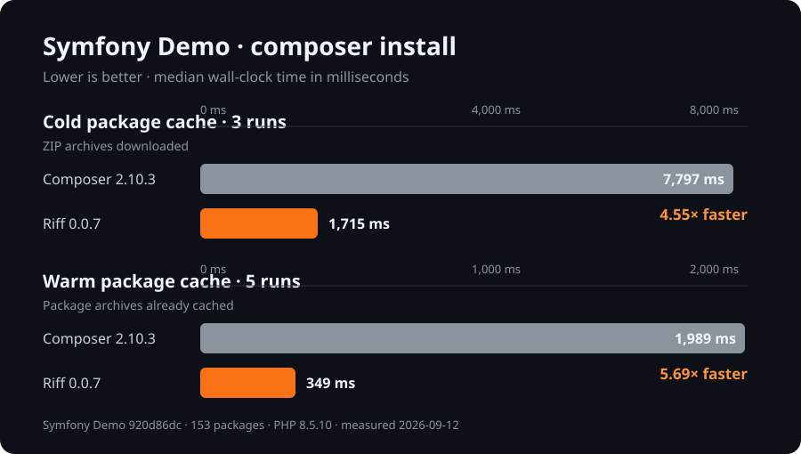

# Riff

[](https://github.com/shyim/riff/actions/workflows/ci.yml)

Riff is a fast, standalone Composer-compatible package manager written in
Rust. It resolves dependencies, downloads packages, installs them, generates
autoload files, and provides the day-to-day commands PHP projects expect from
Composer.

Riff is under active development. It targets the common Composer workflow,
but it is not yet a drop-in replacement for every Composer project—especially
projects that execute arbitrary PHP Composer plugins. See
[Compatibility](docs/compatibility.md) before adopting it in an existing
project.

## Why Riff?

- A native binary for dependency resolution, repository access, installation,
  inspection, and autoload generation.
- Composer-compatible `composer.json`, `composer.lock`, global configuration,
  authentication, scripts, and familiar commands.
- First-class package patching, including declarative
  `cweagans/composer-patches` 1.x and 2.x configuration without requiring the
  PHP plugin.
- Native Symfony Flex 2.x recipes, aliases, packs, auto-scripts, recipe
  inspection and three-way recipe updates without loading the PHP plugin.
- Mutation-safe dry runs and newline-delimited JSON output for CI and editor
  integrations.
- A dedicated Riff cache that never mixes runtime data with Composer's
  cache.
- A `composer` executable shim for workflows that hard-code the binary name.

Riff does not embed PHP. It starts PHP only to discover runtime platform facts
or execute an `@php` project script.

## Benchmark



These are local wall-clock medians measured on 2026-08-26 using
[`symfony/demo`](https://github.com/symfony/demo) at commit `920d86d` (153
packages), PHP 8.5.9, Composer 2.10.2, and Riff 0.0.2. Each tool installed into
a fresh working tree with `install` plus `--prefer-dist`, `--no-interaction`,
`--no-progress`, `--no-plugins`, `--no-scripts`, and `--no-ansi`; Riff also used
`--no-audit` because Composer does not audit on install by default. The tools
alternated order across three cold-cache runs and five warm-cache runs. Cold
runs used empty, isolated caches, so package ZIP archives were downloaded; warm
runs reused only the archive cache populated by the final cold run. Results
will vary by machine and network conditions.

## Install with Homebrew

Homebrew core already uses the name `riff` for an unrelated tool, so install
Riff's namespaced `php-riff` formula from the official tap:

```sh
brew install shyim/tap/php-riff
```

The formula installs the executable as `riff` and generates Bash, Zsh, and
Fish completions. PHP is installed as a Homebrew dependency.

## Install a release binary

Prebuilt binaries are available from
[GitHub Releases](https://github.com/shyim/riff/releases) for Linux, macOS,
and Windows on x86-64 and ARM64. Download the archive matching your target,
verify it with the release's `SHA256SUMS`, and place `riff` or `riff.exe`
on your `PATH`.

Release archives contain only the preferred `riff` executable. Build from
source when you also want the Composer-compatible `composer` executable.

## Install from source

Riff currently requires Rust 1.98.0 and PHP 7.2.5 or newer for
platform-dependent operations.

```sh
git clone https://github.com/shyim/riff.git
cd riff
cargo install --path crates/riff --locked
riff --version
```

This installs both `riff` and the Composer-compatible `composer` shim. If you
already have a `composer` executable in Cargo's binary directory, build the
workspace and copy only `target/release/riff`, or choose which executable
appears first on `PATH`.

## Quick start

Use Riff in an existing Composer project:

```sh
riff validate
riff install
riff check-platform-reqs
```

Manage dependencies with familiar commands:

```sh
riff require psr/log:^3
riff update symfony/console --with-dependencies
riff remove vendor/package
```

Preview a mutation without changing the project:

```sh
riff require vendor/package:^2 --dry-run
riff update --dry-run
```

Run `riff --help` for the complete command list and
`riff <command> --help` for authoritative option details.

## Documentation

- [Getting started](docs/getting-started.md) — installation, first project,
  migration, and shell completion
- [Everyday usage](docs/usage.md) — dependency workflows, scripts, dry runs,
  output, and CI
- [Command reference](docs/commands.md) — the complete command surface,
  grouped by task
- [Configuration](docs/configuration.md) — PHP selection, global config,
  authentication, environment variables, and cache behavior
- [Rust library API](docs/library.md) — inject platform facts and execute
  commands without PHP detection
- [Package patching](docs/patching.md) — native patch authoring and Composer
  Patches compatibility
- [Compatibility](docs/compatibility.md) — supported Composer behavior,
  native plugin adapters, and intentional limits
- [Troubleshooting](docs/troubleshooting.md) — diagnostics and common recovery
  steps
- [Contributing](CONTRIBUTING.md) — local setup, focused tests, compatibility
  fixtures, and pull requests

The [documentation index](docs/README.md) provides suggested reading paths.

## Contributing

Contributions are welcome. Start with [CONTRIBUTING.md](CONTRIBUTING.md), then
use [TESTING.md](TESTING.md) for the fastest test command for the area you are
changing, including Composer parity and fixture inventory checks.

## License

Riff is available under the [MIT License](LICENSE).
